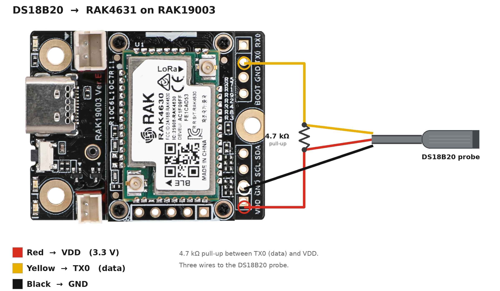

# PoolTemp

A floating, solar-powered **pool thermometer** that reads the water and sends the temperature over **MeshCore** — no WiFi, no cloud, no gateway. It sleeps, wakes up on a timer, reads a waterproof sensor, pushes the reading to a mesh channel, and goes back to sleep.

PoolTemp is a small fork of [MeshCore](https://github.com/meshcore-dev/MeshCore), based on my earlier sensor-node firmware. The only real change is which pin the temperature sensor uses.

> **New here? You're in the right place.** For the full technical reference — exact pin mapping, board revisions, the Serial2 vs Serial1 detail, and building from source — see [TECHNICAL.md](TECHNICAL.md).

---

## What you need

| Part | Notes |
|---|---|
| RAK4631 WisBlock Core | nRF52840 + SX1262, EU868 (or your region) |
| RAK19003 WisBlock Mini Base | The mini base has a **built-in solar charger** |
| DS18B20 waterproof probe | 1-Wire temperature sensor on a cable |
| 4.7 kΩ resistor | Pull-up for the sensor (required) |
| 18650 Li-ion cell + 1S protection board | Any decent 18650; a 1S BMS strip protects it |
| 4x small 5 V solar panels | Wired **in parallel** (never in series) |
| U.FL → SMA pigtail + 868 MHz antenna | |

3D-printed enclosure — STLs and print settings are on MakerWorld:
**[Solar Pool Thermometer (MeshCore) on MakerWorld](https://makerworld.com/sv/models/3153007-solar-pool-thermometer-meshtastic-meshcore)**

---

## Wiring

The DS18B20 has three wires. On the RAK19003 header:

| Sensor wire | Goes to | RAK pad |
|---|---|---|
| Red (power) | 3.3 V | **VDD** |
| Yellow (data) | data line | **TX0** |
| Black (ground) | ground | **GND** |

Plus a **4.7 kΩ resistor between the data line (TX0) and 3.3 V**. Without this pull-up the sensor cannot talk to the board — this is the number-one reason a build "gets no reading".



> **Which pin is the data line?** On the RAK19003 **Ver.D / Ver.E** the header pad is silkscreened **TX0**, which is `PIN_SERIAL2_TX` = P0.20. If your board is the older **Ver.B** (silkscreened TX1), use `PIN_SERIAL1_TX` instead — see the comment in `src/pooltemp_config.h`.

Solar: wire all four panels **in parallel** (all reds together, all blacks together) into the RAK's solar connector. In series they would produce ~20 V and destroy the board.

---

## Flashing (the easy way)

You do **not** need to build anything. Grab a ready-made file from the [**Releases**](../../releases) page:

- `pooltemp_2min.uf2` — sends every **2 minutes** (great for testing and setup)
- `pooltemp_1h.uf2` — sends **once an hour** (for real, long-term use on battery)

Then:

1. Plug the RAK board into your computer with USB.
2. **Double-tap** the small reset button on the board. It pops up as a USB drive.
3. **Drag** the `.uf2` file onto that drive.
4. The board reboots and starts running. Done.

Start with `pooltemp_2min.uf2` so you see readings quickly, then flash `pooltemp_1h.uf2` before you seal it up.

---

## Seeing the readings

PoolTemp sends to the channel **`#pooltemp`**. Add that channel on your phone/MeshCore client (or another node) and the temperature will show up there. If you don't see anything, first make sure you are actually listening on `#pooltemp` — that catches most people.

---

## Build from source (optional)

Only needed if you want to change something.

```bash
# PlatformIO
pio run -e RAK_4631_pooltemp        # 2-minute test build
pio run -e RAK_4631_pooltemp_sleep  # 1-hour field build
```

The transmit interval and the sensor pin are set in `src/pooltemp_config.h`.

---

## Troubleshooting

**No reading / sensor not found**
- Check the **4.7 kΩ pull-up** is actually between the data line and 3.3 V.
- Check the data wire is on **TX0**, not the neighbouring pad.
- Confirm your base board revision and pin (see the note above).

**Firmware runs but nothing shows up**
- Your receiver must be on the **`#pooltemp`** channel.
- Confirm the `.uf2` finished copying and the board rebooted.

**Nothing at all / no boot**
- Re-flash. Double-tap the button, make sure the drive appears, drag the file again.

---

## Credits

Built on [MeshCore](https://github.com/meshcore-dev/MeshCore). Firmware and hardware by IterationX.
Video build: [YouTube](https://youtube.com/@IterationX) · Planning tool: [MeshPeaks](https://meshpeaks.com)
